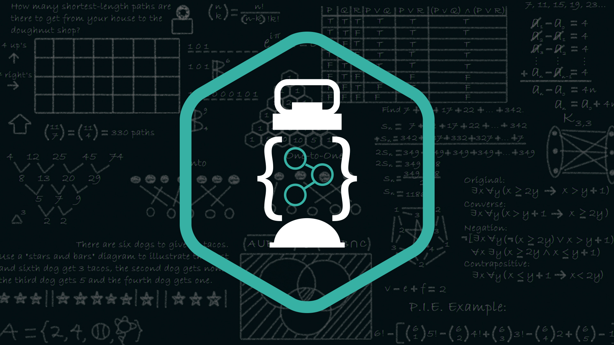

## Data Structures and Algorithms

> Data dominates. If you've chosen the right data structures and organized things well, the algorithms will almost always be self-evident. Data structures, not algorithms, are central to programming.
> -Rob Pike

This repository contains the implementations of fundamental data structures & algorithms: arrays, linked lists, stacks, queues, and sorting in JAVA.

The following use cases are included:    

 **1. Array**
* *frequency_sort.java*
* *min_sum.java*
* *Operations.java*

**2. Linked List**
* *add.java*
* *circular_list.java*
* *detect_loop.java, dll_deletion.java, dll_insertion.java, InsertCircular.java, Linear_Llist.java, middle.java, nth_lastnode.java, palindrome.java, reverse.java, sort.java, split_circularlist.java*

**3. Queue**
* *circular_queue.java*
* *Queueusingarray.java*

**4. Sorting**
* *BubbleSort.java*
* *InsertionSort.java*
* *MergeSort.java, QuickSort.java, SelectionSort.java*

**5.Stack**
* *balanced_paranthesis*
* *infixtopostfix.java*
* *infixtoprefix.java, Llist_palindrome.java, post_evaluation.java, postfixtoinfix.java, postfixtoprefix.java, pre_evaluation.java, prefixtoinfix.java, pretopost.java, Stacks.java*
